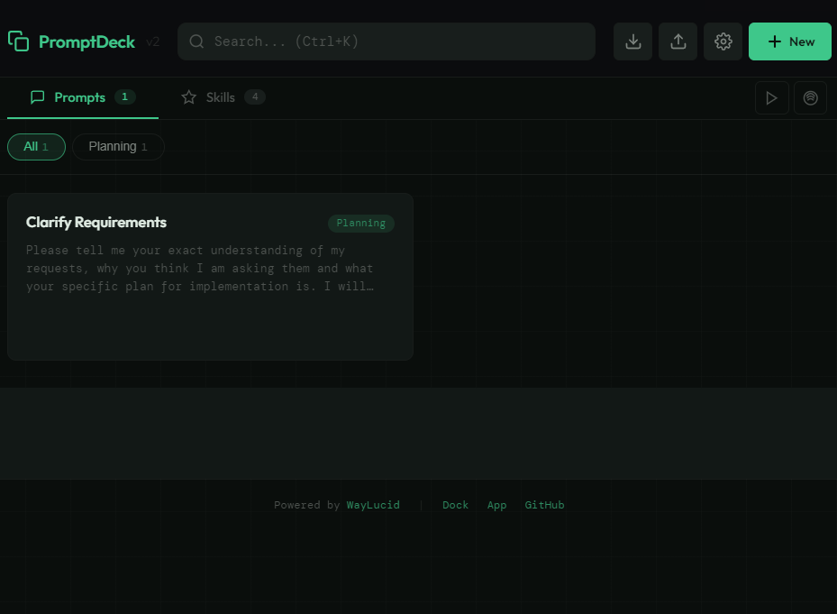
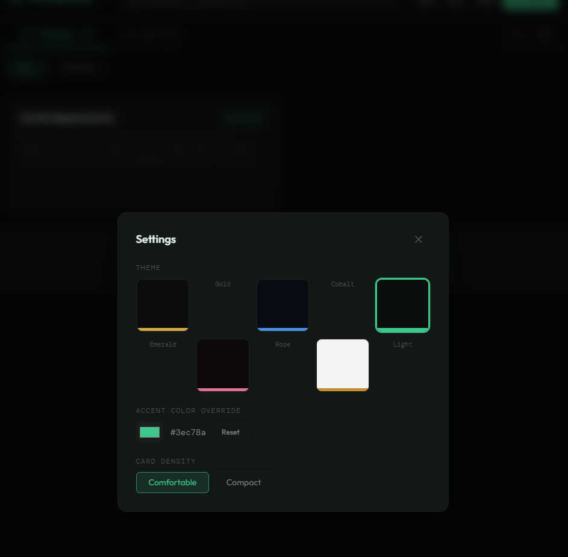

# PromptDeck

**Your AI prompt clipboard — click, copy, done.**

Free forever. MIT licensed. No accounts. No cloud. No telemetry.

PromptDeck is a desktop utility for anyone who works with AI tools. Save your favorite prompts, code snippets, checklists, and shortcuts — then copy any of them with a single click.

Built by [WayLucid](https://www.waylucid.com).

[](screenshots/promptdeck-layout.png)

---

## Features

**Prompt Board** — Save and organize reusable prompts for Claude, ChatGPT, or any AI tool. Categories, search, drag-and-drop reorder.

**Skills Board** — A second board for code snippets, shell commands, checklists, and reference cards. Tag by language, type as snippet/checklist/reference.

**Themes** — Five built-in color themes (Dark Gold, Cobalt, Emerald, Rose, Light) plus a custom accent color picker. Your workspace, your look.

[](screenshots/promptdeck-themes.png)

**Media Widgets** — Embedded YouTube and Spotify players in collapsible panels. Background music or tutorial videos while you work.

**One-Click Copy** — Click any card to instantly copy its text to your clipboard. Green flash confirms it worked.

**Import / Export** — Back up your library as JSON. Share prompt collections with your team. Import on any machine.

**Keyboard Shortcuts** — `Ctrl+K` to search, `Escape` to close modals. Fast and keyboard-friendly.

---

## Install

### Option 1: Browser (Easiest)

Open `index.html` directly in any modern browser. All features work without Electron (except the frameless window chrome). No install required.

### Option 2: Desktop App (Windows)

1. Download the latest `.exe` from [Releases](https://github.com/WL-MadHacker/promptdeck-public/releases)
2. Run `PromptDeck Setup.exe`
3. Launch from your taskbar

> **Note:** Windows SmartScreen may show a "Windows protected your PC" warning because the app is not code-signed. This is normal for independent open-source software. Click **"More info"** → **"Run anyway"** to proceed. The source code is fully available in this repo for inspection.

### Option 3: Run from Source

```
git clone https://github.com/WL-MadHacker/promptdeck-public.git
cd promptdeck-public
npm install
npm start
```

### Build Installer

```
npm run installer
```

---

## Tech Stack

- **Electron** — Native desktop wrapper (frameless window, taskbar pinning)
- **Vanilla HTML/CSS/JS** — Zero dependencies, single-file architecture
- **localStorage** — All data stays on your machine
- **Google Fonts** — Outfit + DM Mono

---

## Data & Privacy

PromptDeck stores everything in your browser's `localStorage`. Nothing leaves your machine. No accounts, no telemetry, no analytics. Your prompts are yours.

---

## Part of the WayLucid Ecosystem

PromptDeck is a free, open-source tool from [WayLucid](https://www.waylucid.com) — building AI-native products for people who ship.

- [WayLucid](https://www.waylucid.com) — AI-native product studio
- [Dock](https://dock.waylucid.com) — Command center for AI workflows
- [App](https://app.waylucid.com) — WayLucid platform

---

## Contributing

See [CONTRIBUTING.md](CONTRIBUTING.md) for guidelines.

## License

[MIT](LICENSE)
